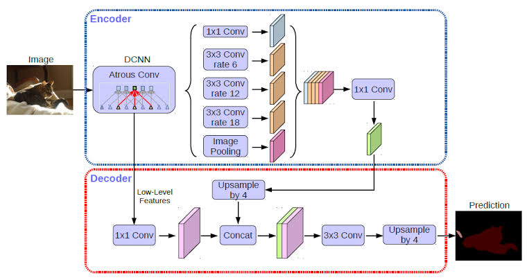

# Semantic Segmentation from Scratch


Independently implemented and trained U-Net and DeepLabV3+ semantic segmentation models from scratch in PyTorch on a personal PC for educational purposes. Applied to Kaggle's Carvana (binary masking) and Cityscapes (multi-class urban scenes) datasets, with integrated visualization tools for mask overlays and performance plotting.

## Features
- **Models**: U-Net (encoder-decoder with skip connections) and DeepLabV3+ (ASPP for multi-scale context, ResNet-50 backbone).
- **Datasets**:
  - [Carvana Image Masking Challenge](https://www.kaggle.com/c/carvana-image-masking-challenge) – Binary segmentation (car vs. background).
  - [Cityscapes Dataset](https://www.kaggle.com/datasets/shuvoalok/cityscapes) – Multi-class (19 classes: roads, vehicles, pedestrians, etc.).
- **Tools**: Jupyter notebooks for experiments, visualization scripts for predicted masks, and evaluation via pixel accuracy & mIoU.
- **Educational Focus**: Hands-on from-scratch builds to explore challenges like resolution loss and feature fusion.

## Model Architectures 
### U-Net Architecture 

### Deeplabv3+ Architecture 



## Setup
1. **Clone the Repo**:
   ```
   git clone https://github.com/abeshahsan/semantic-segmentation-from-scratch.git
   cd semantic-segmentation-from-scratch
   ```

2. **Install Dependencies**:
   ```
   pip install -r requirements.txt
   ```
   (Includes NumPy, Matplotlib, PyTorch, etc.—no internet-heavy installs needed.)

3. **Download Datasets**:
   - Carvana: Download from [Kaggle](https://www.kaggle.com/c/carvana-image-masking-challenge) and extract to `./data/carvana/`.
   - Cityscapes: Download from [Kaggle](https://www.kaggle.com/datasets/shuvoalok/cityscapes) and extract to `./data/cityscapes/`.
   - Update paths in `config/` files or notebooks as needed.

## Usage
- **Quick Start in Colab**: Open [`unet_experiment_colab.ipynb`](notebooks/unet_experiment_colab.ipynb) for interactive training/visualization (supports both models/datasets).
- **Train U-Net**:
  ```
  python training/train_unet.py --dataset carvana --epochs 50
  ```
- **Train DeepLabV3+**:
  ```
  python training/train_deeplabv3.py --dataset cityscapes --epochs 50
  ```
- **Visualize Results**: Run scripts in `./visualizer/` to generate mask overlays:
  ```
  python visualizer/visualize_masks.py --model unet --input_dir ./data/carvana/test/
  ```
- **Evaluate**: Use built-in metrics in notebooks—tracks pixel accuracy and mIoU per epoch.

## Structure
- **/config/**: Hyperparameters and dataset paths.
- **/data/**: Dataset loading utilities.
- **/models/**: U-Net and DeepLabV3+ definitions.
- **/notebooks/**: Interactive experiments.
- **/training/**: Training scripts with loss functions.
- **/visualizer/**: Mask generation and plotting tools.
- **labels.py**: Class mappings for datasets.
